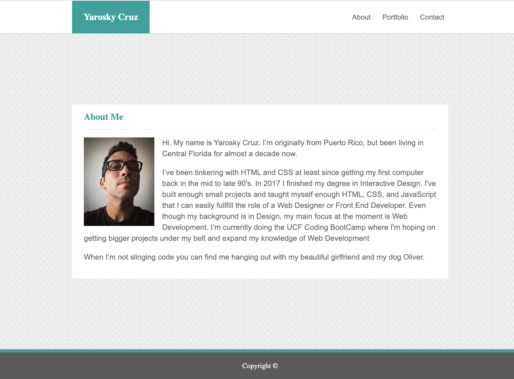

# Barebones Portfolio / [Demo](https://yarocruz.github.io/portfolio/)



## Description 

This is a simple portfolio static website. One of the purposes of the project was to refamiliarize myself wih [Git](https://git-scm.com/) and [Github](https://github.com/) and to start getting into the habit of adding version control to my web development workflow. Another reason for the project is to have somewhere I can point to potential employers while I'm completing the [UCF Coding Bootcamp](https://bootcamp.ce.ucf.edu/coding/). While I do have a [Github Page](https://yarocruz.github.io/) where people can learn a bit about me, I don't have at the moment a proper portfolio. 

## Technologies

Built with plain ol' HTML and CSS. Uses the [Meyer Web](https://meyerweb.com/eric/tools/css/reset/) CSS reset. Media queries were added accordingly to make website responsive. I also used [Flexbox](https://developer.mozilla.org/en-US/docs/Web/CSS/CSS_Flexible_Box_Layout/Basic_Concepts_of_Flexbox) to build the navigation. 

## Problems / Solutions

One of the biggest issues I had with this project was finding a good solution for making the footer stay at the bottom. Since there isn't enough content to push it down, my first attempt was to to use fixed positioning, but that created issues in mobile view. I ended up googling and found a good solution on [Stack Overflow](https://stackoverflow.com/questions/50429737/sticky-footer-with-flexbox)

```
.main-wrap {
	display: flex;
	flex-direction: column;
	min-height: 100vh;
	justify-content: space-between;
}
```
Since it only has three main div's this solution I think works the best. 

## Demo

See demo [here](https://yarocruz.github.io/portfolio/)

## License 

[MIT](/LICENSE) 2020

Feel free to clone this repo and modify accordingly.


